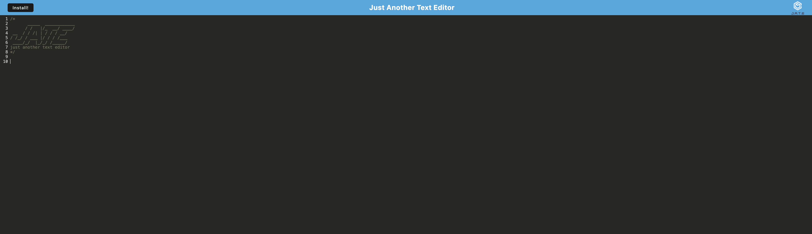
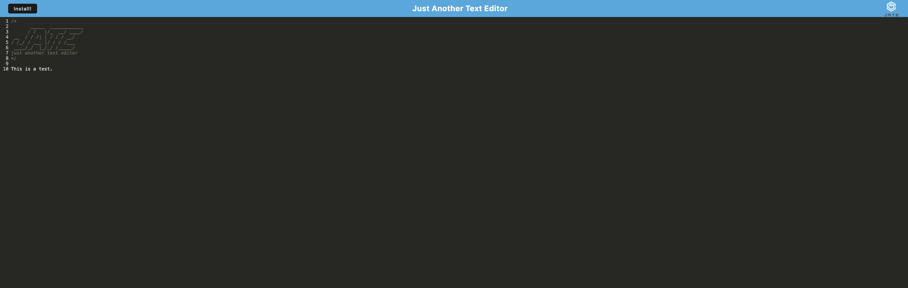

# PWA--Presents-A-Text-Editor

## Table of Contents
* [Installation](#installation)
* [Description](#description)
* [Usage](#usage)
* [Contributions](#contributions)
* [License](#license)
* [Credits](#credits)
* [Tests](#tests)
* [Questions](#questions)

## Installation
To install, please clone this repository to your computer using the following steps in Github:

1. Click the "Code" dropdown menu and copy the SSH URL.
2. Open your terminal and navigate to the directory you would like to clone this repository into.
3. Type "git clone <paste SSH URL>", replacing <paste SSH URL> with your copied SSH URL. You can substitute an SSH URL with an HTTPS URL.
4. Press enter.

## Description
This is a single-page, PWA text editor that allows the user to write and save text. It can be used both online in a browser, or installed and used offline locally.

## Usage
To run this program, enter the following commands into your terminal:

npm install
npm run build
npm start

Once the command line outputs that it's listening on localhost 3000, navigate to the aforementioned localhost. You should see the following:

From here, you can add and remove text of your choice.

If you click the "install" button on the top left hand corner of the screen, you can also download the program and play it locally on your device.

Functionality is identical for both the browser-based and desktop-based versions of the program. Text data is saved to IndexDB and will reappear if you exit and reenter the program.

## Contributions
When contributing to this repository, please reach out to me via e-mail to discuss the change you would like to make first. I am open to ideas both with regards to data stored in the tables and alterations to user interaction with the data.

## License
This project is licensed under the MIT License. For more information, please see the [MIT License](https://opensource.org/licenses/MIT).

## Credits
This program was created by Jacob McAuliffe for the UC Berkeley eDX Coding Boot Camp.

## Tests
In the future, I would like to give the text editor greater functionality both with regards to the content of the text. Some ideas include the ability to include links, spellcheck words, change fonts/colors. Greater utility for how text is saved and used could also factor in. Incorporating the ability to turn texts into e-mails or upload to a specified drive or cloud could also prove useful.

## Questions
If you have further questions, you can reach me at [mcauliffemedia@gmail.com](mailto:mcauliffemedia@gmail.com).

GitHub Account: [jacobmca](https://github.com/jacobmca)
